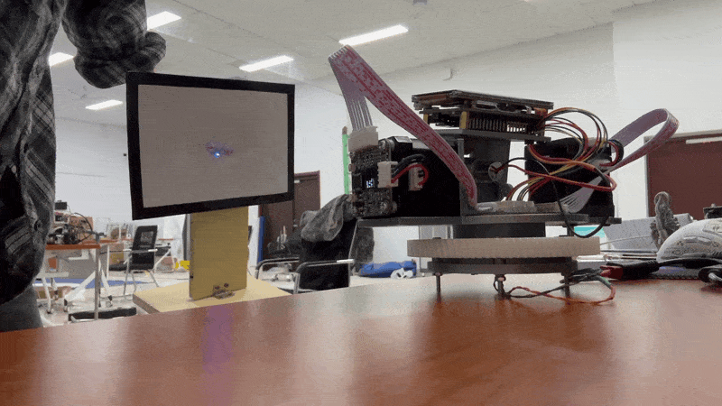

# 2025年电赛E题 - 步进电机云台追踪系统

适配2025年全国大学生电子设计竞赛E题设计的二维步进电机云台，能够实时追踪视频中的矩形目标。

## 硬件清单

- **主控**: 嘉楠 CanMV-K230 开发板
- **电机**: 张大头闭环步进电机
- **云台3D打印件**: 自己设计的，已发布到拓竹Maker World社区

## 软件依赖

- **固件版本**: `CanMV_K230_LCKFB_micropython_v1.5-legacy-0-g413737f_nncase_v2.9.0.img.gz`
- **主程序**: `follow_rectangle.py`

## 如何使用

1.  确保您的 K230 开发板已刷入指定的固件版本。
2.  将 `follow_rectangle.py` 文件下载到开发板。
3.  连接好摄像头、电机和显示屏。
4.  运行程序，云台将自动开始寻找并追踪矩形。

## 项目文件说明

- `follow_rectangle.py`: 主控制程序，实现了矩形识别、滤波和电机控制逻辑。
- `ProPrj_New Project_2026-03-26_23-50-09_2026-04-04.epro`: 项目的PCB电路设计文件。

## 相关链接

- **拓竹Maker World社区模型链接**: [https://makerworld.com.cn/zh/models/2452910-25nian-dian-sai-eti-er-wei-bu-jin-dian-ji-yun-tai#profileId-2798121](https://makerworld.com.cn/zh/models/2452910-25nian-dian-sai-eti-er-wei-bu-jin-dian-ji-yun-tai#profileId-2798121)
- **Bilibili视频**: 

如果有小伙伴需要整套成品，可以去我的闲鱼主页看看，闲鱼搜索“Tron不可贴”
